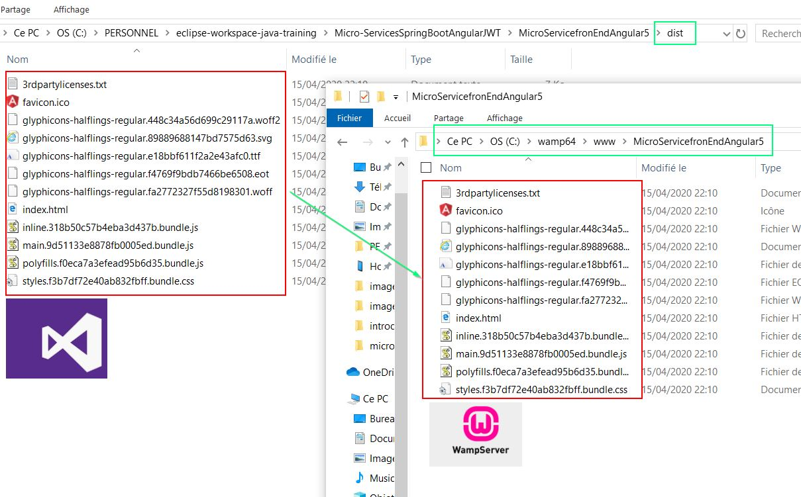
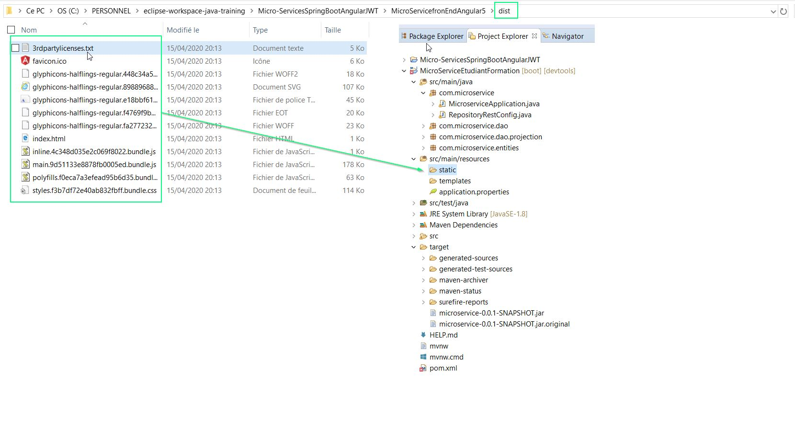
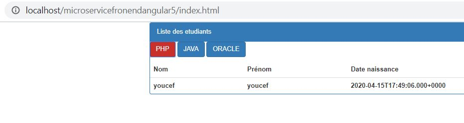

# Micro Service Front End Angular

## angular update

[update angular](https://update.angular.io)

## configurer une nouvelle application

Dans ce projet c'est la version Angular 5.2.0 qui utilisé. ( angular/cli@1.7.4)

Voir github pour installer eventuellement une vesion précise d'angular.


 ```bash
 C:\PERSONNEL\eclipse-workspace-java-training\Micro-ServicesSpringBootAngularJWT
 λ ng new MicroServicefronEndAngular5
 ```
 
##  Allow CORS

see backend service
 
 ````java
 package com.microservice;
 
 import org.springframework.context.annotation.Configuration;
 import org.springframework.data.rest.core.config.RepositoryRestConfiguration;
 import org.springframework.data.rest.webmvc.config.RepositoryRestConfigurerAdapter;
 
 import com.microservice.entities.Etudiant;
 import com.microservice.entities.Formation;
 
 @Configuration
 public class RepositoryRestConfig extends RepositoryRestConfigurerAdapter { 
 
     @Override 
     public void configureRepositoryRestConfiguration(RepositoryRestConfiguration config) { 
      config.setReturnBodyOnCreate(true);
      config.setReturnBodyOnCreate(true);
      config.setReturnBodyForPutAndPost(true);
      config.exposeIdsFor(Etudiant.class,Formation.class); // n'expose que ces classes
     	config.getCorsRegistry() 
         .addMapping("/**") 
         .allowedOrigins("*") 
         .allowedHeaders("*") 
         .allowedMethods("OPTIONS", "HEAD", "GET", "PUT", "POST", "DELETE", "PATCH"); 
     } 
 
 } 

 ````
 
 
## bootstrap 
 
installation bootstrap : 
````bash
npm install bootstrap@3 --save
````

editer le fichier de configuration. angular-cli.json section **style** et **script**

````json
{
  "$schema": "./node_modules/@angular/cli/lib/config/schema.json",
  "project": {
    "name": "micro-servicefron-end-angular5"
  },
  "apps": [
    {
      "root": "src",
      "outDir": "dist",
      "assets": ["assets", "favicon.ico"],
      "index": "index.html",
      "main": "main.ts",
      "polyfills": "polyfills.ts",
      "test": "test.ts",
      "tsconfig": "tsconfig.app.json",
      "testTsconfig": "tsconfig.spec.json",
      "prefix": "app",
      "styles": [
        "styles.css",
        "../node_modules/bootstrap/dist/css/bootstrap.min.css"
      ],
      "scripts": ["../node_modules/bootstrap/dist/js/bootstrap.min.js"],
      "environmentSource": "environments/environment.ts",
      "environments": {
        "dev": "environments/environment.ts",
        "prod": "environments/environment.prod.ts"
      }
    }
  ],
  "e2e": {
    "protractor": {
      "config": "./protractor.conf.js"
    }
  },
  "lint": [
    {
      "project": "src/tsconfig.app.json",
      "exclude": "**/node_modules/**"
    },
    {
      "project": "src/tsconfig.spec.json",
      "exclude": "**/node_modules/**"
    },
    {
      "project": "e2e/tsconfig.e2e.json",
      "exclude": "**/node_modules/**"
    }
  ],
  "test": {
    "karma": {
      "config": "./karma.conf.js"
    }
  },
  "defaults": {
    "styleExt": "css",
    "component": {}
  }
}

````


http://joeljoseph.net/angular-6-deploy-on-apache-server-by-solving-404-not-found-error-on-page-refresh/


## Deployment de l'application front sur un wamp.


si l'application n'est pas deployer a la racine mais sur un folder, il fau alos preciser par --base-href

### generer un build de l'application
````bash
C:\PERSONNEL\eclipse-workspace-java-training\Micro-ServicesSpringBootAngularJWT\MicroServicefronEndAngular5> ng build --prod --base-href=microservicefronendangular5
````


### copier l'application sur le serveur wamp 

copier le repertoire **dist** vers le repertoire cible




### Deployement dans l'application spring. ( pas préconsier dans une architecture micro-service)

copier le repertoire **dist** d'angular vers le repertoire **resource/static** dans le projet spring.




## test de l'application de puis le server wamp


