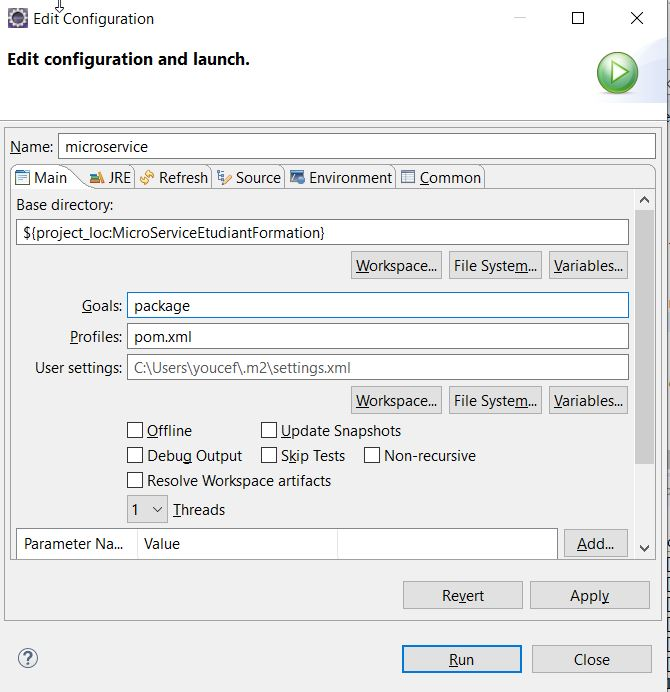
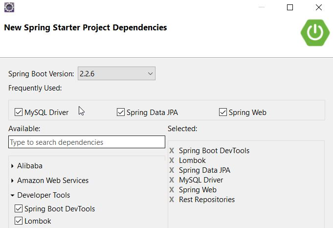
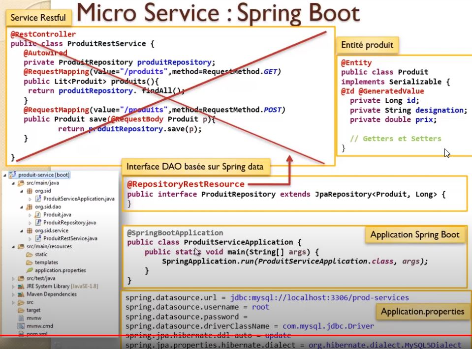
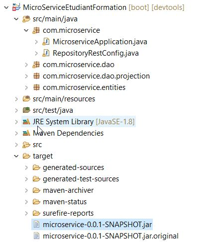
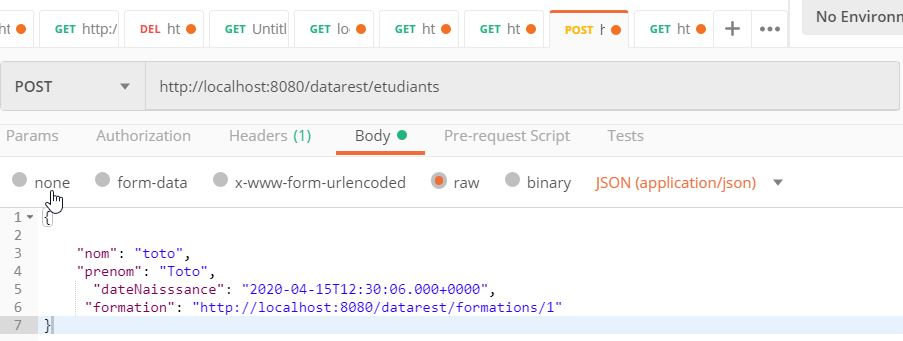

# Micro Service Etudiant et formation


## Creation d'un projet spring.
 

 


## Rest Service Via spring data Rest

### entities

entite Etudiant
````java
package com.microservice.entities;

import java.util.Date;

import javax.persistence.Entity;
import javax.persistence.GeneratedValue;
import javax.persistence.GenerationType;
import javax.persistence.Id;
import javax.persistence.JoinColumn;
import javax.persistence.ManyToOne;

import lombok.AllArgsConstructor;
import lombok.Data;
import lombok.Getter;
import lombok.NoArgsConstructor;
import lombok.Setter;

@AllArgsConstructor
@NoArgsConstructor
@Data
@Entity
public class Etudiant {

	@Id
	@GeneratedValue(strategy = GenerationType.IDENTITY)
	private Long id;
	private String nom;
	private String prenom;
	private Date dateNaisssance;

	@ManyToOne
	// @JoinColumn(name="ID_ETUDIANT") // par defaut dans la base sera formation_id
	private Formation formation;

}
````

entite Formation
````java
package com.microservice.entities;

import java.util.Collection;

import javax.persistence.Entity;
import javax.persistence.GeneratedValue;
import javax.persistence.GenerationType;
import javax.persistence.Id;
import javax.persistence.OneToMany;

import lombok.AllArgsConstructor;
import lombok.Data;
import lombok.NoArgsConstructor;

@AllArgsConstructor
@NoArgsConstructor
@Data
@Entity
public class Formation {

	@Id
	@GeneratedValue(strategy = GenerationType.IDENTITY)
	private Long id;
	private String nom;
	private int duree;

	@OneToMany(mappedBy = "formation") // reference formation dans Etudiant classe
	private Collection<Etudiant> etudiants;

}
````

###  Rest Controller

 

````java
package com.microservice.dao;

import java.util.List;

import org.springframework.data.jpa.repository.JpaRepository;
import org.springframework.data.repository.query.Param;
import org.springframework.data.rest.core.annotation.RepositoryRestResource;
import org.springframework.web.bind.annotation.CrossOrigin;

import com.microservice.entities.Etudiant;

@RepositoryRestResource  

public interface IEtudiantRepository extends JpaRepository<Etudiant, Long> {

	public List<Etudiant> findByNomStartsWith(String nom);
	public List<Etudiant> findByNomContains(String nom);
	public List<Etudiant> findByPrenomContains(String nom);

	// @query ("select p from Etudiant e where e.nom like :x")
	// public List<Etudiant> contient(@Param("x")String nom) ;

}
````

````java
package com.microservice.dao;

import java.util.List;

import org.springframework.data.jpa.repository.JpaRepository;
import org.springframework.data.repository.query.Param;
import org.springframework.data.rest.core.annotation.RepositoryRestResource;

import com.microservice.entities.Etudiant;
import com.microservice.entities.Formation;

@RepositoryRestResource
public interface IFormationRepository extends JpaRepository<Formation, Long> {

	// public List<Formation> findByNomStartsWith(String nom);
	// public List<Formation> findByNomContains(String nom);

}
````
## projection  ( equivalent à filter sur des clonne bien précise)
une projection de **spring rest data** permet de ne renvoyer que des attributs qui nous interesent dans des requetes **rest**


````java
package com.microservice.dao.projection;

import org.springframework.data.rest.core.config.Projection;

import com.microservice.entities.Etudiant;


// une projection est équivalent d'une vue
@Projection(name = "p1", types = { Etudiant.class })
public interface IEtudiantProjection {
	public String getNom();
}
````
 


## deployement package
 

 


## test Application 
 


 
