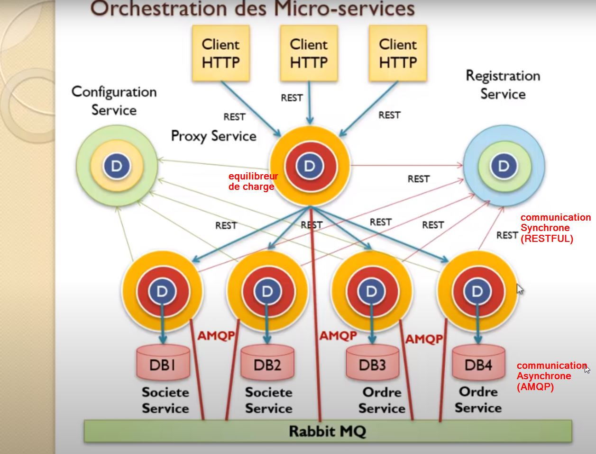
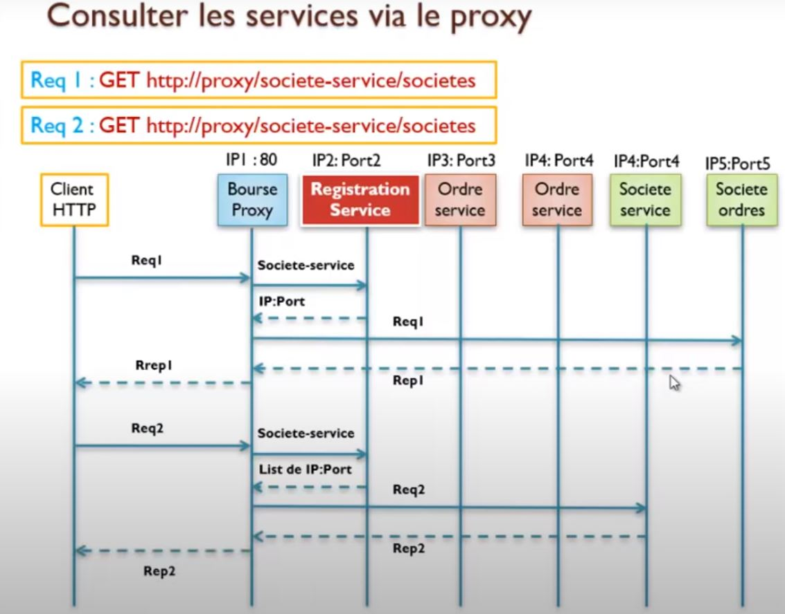
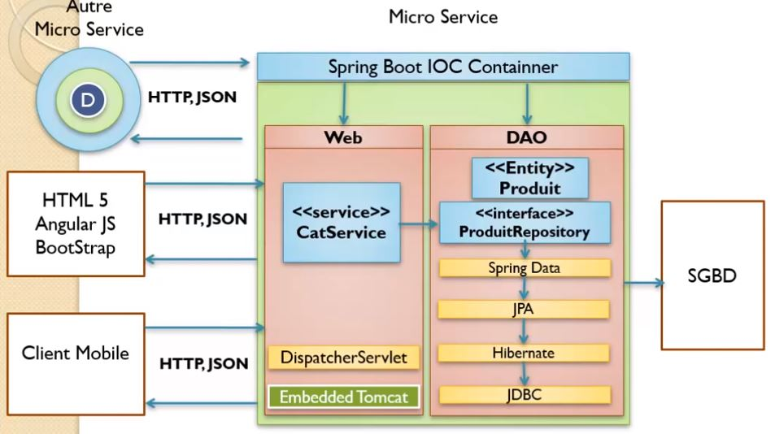

# Micro Service

## Architecture micro sevice
Il faut prévilié les communicatin asynchrone ( surtout entre micro service)

## mise en oeuvre

[Mise en oeuvre: microService etudiant et formation ](doc/microServiceProduit.md)

[Mise en oeuvre: front end](doc/FrontEndAngular.md)

